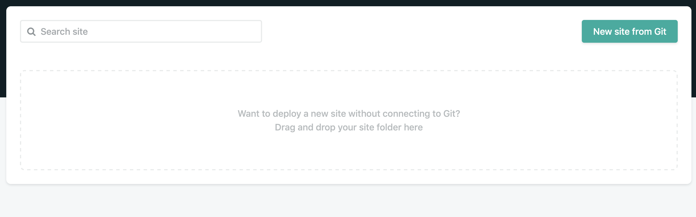
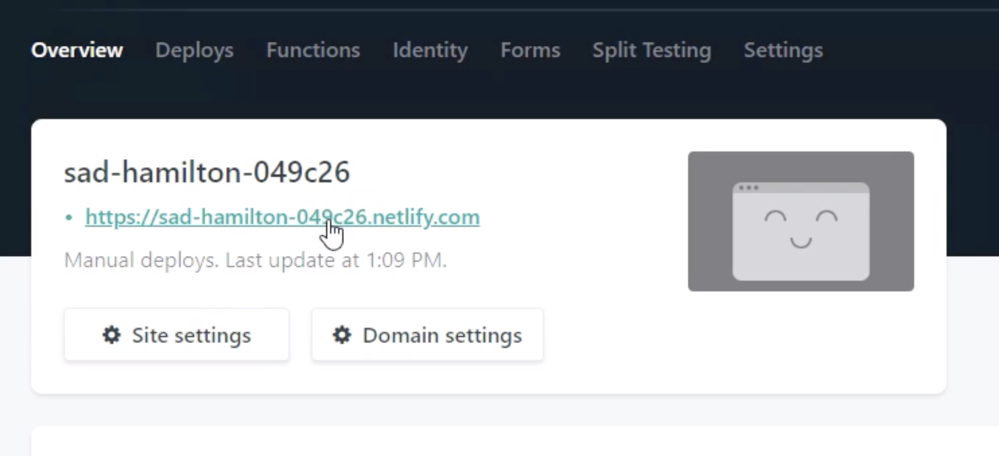
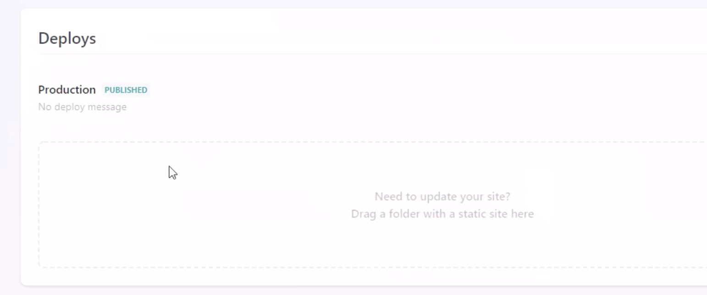

Опубликованная страница: https://sad-hamilton-049c26.netlify.com/

Наш интенсив по Ruby on Rails: http://bit.ly/2PlYdYI

### Prerequisites

В этом коротком видео научимся публиковать простую HTML + CSS страницу в считанные секунды. Надеемся, такая страница у вас уже есть или вы более менее знаете, что такое HTML, CSS и как ими пользоваться.

Мы не будем изучать, как устроены домены, хостинги или как рботает сеть – будем просто брать и публиковать страницу. Поехали!

У нас есть самая простая HTML-страница с подключёнными стилями, которая выглялит вот так:

Все исходники в приложении.

### Деплой

Публиковать такие страницы помогают многие сервисы. Мы воспользуемся [Netlify](https://app.netlify.com), где для начала надо зареистрироваться. После регистрации оказываемся на этой странице:

Всё что нам нужно сделать – это перетащить папку с проектом в поле. Система даёт нам случайный поддомен и деплоит страницу.

Готово! Теперь она висит в Интернете и доступна любому, кто о ней узнает.

### Внесение изменений

Что если мы поменяем что-либо на нашей странице? В личном кабинете идём в раздел Deploys и перетаскиваем снова папку проекта полностью.

Обновляем страницу – всё поменялось и работает. Как видите, всё максимально просто.

Есть ещё как минимум пара сайтов, в том числе [pages.github](https://pages.github.com), где можно сделать то же самое. Хотя это будет немного сложнее. Netlify – самый простой. Эти сервисы можно использовать для деплоя не только несложных страниц-визиток, но и более серьёзных сайтов и приложений.
